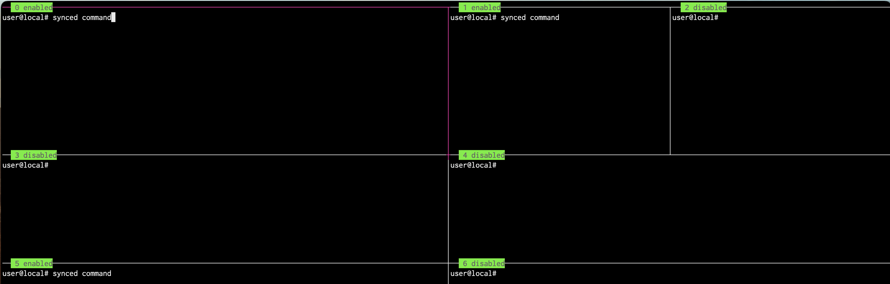

# Paneblocker tmux
Script to disable/enable input on selected tmux panes. Useful for 'selecting' which panes you want to synchronize without having to synchronize all panes in tmux.

### Installation
Download the paneblock script.
Make the file executable (`chmod 755 ./paneblock`).
Copy the paneblock script to a directory that exists in your PATH. (`cp paneblock /usr/local/bin`)

### Usage
Call paneblock with the expected 'mode' and target pane indexes. Target indexes are args separated by space.
If using `-i`, the pane index selection will be inverted; ie all panes EXCEPT those specified.
Examples:
```
# Disable input on panes 0,4,6:
paneblock -d 0 4 6

# Enable input on pane 4:
paneblock -e 4

# Re-enable input on all panes:
paneblock -a

# Disable input on all panes EXCEPT 0,4,6:
paneblock -d -i 0 4 6
```

### Optional: Add paneblock status to pane title
If you would like to see the status of each pane, you can add the following to your `tmux.conf` file:
```bash
set -g pane-border-status top
set -g pane-border-format "#[fg=black, bg=green] #{pane_index} #{@custom_pane_title}"
bind < command-prompt -p "New Title: " -I "#{@custom_pane_title}" "set-option -p @custom_pane_title '%%'"
```
This will add a small title bar to each pane, with the pane index number and the status of input - either 'enabled' or 'disabled'


